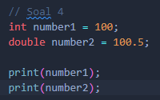
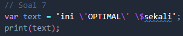

# Pemrograman Mobile Minggu 5

Nama : Sabilla Luthfi Rahmadhan

No Absen : 19

Kelas : TI-3G

NIM : 2141720122

---

## Quiz 1

### Soal 1

Output :

Penjelasan :

Kode diatas(print) digunakan untuk mencetak sebuah teks biasa(Hello World)

### Soal 2

Output :

Penjelasan :

Kode diatas(print) digunakan untuk mencetak variabel dengan tipe data String yang bernilai Sabilla Luthfi Rahmadhan

### Soal 3

Output :

Penjelasan :

Kode diatas pada beris pertamanya membuat variabel firstname bertipe String dengan nilai 'Sabilla' kemudian di baris kedua membuat variabel lastname dengan kunci final dan bernilai String yaitu 'Luthfi'. Kemudian kedua variabel tadi dicetak di baris bawahnya

### Soal 4

Output :

Penjelasan :

Error dikarenakan variabel const tidak dapat dirubah nilai yang sudah di inisialisasi pertama kali

### Perbaikan

Output :

Penjelasan :

Pada baris pertama kode tersebut membuat array final dengan nilai 1,2,3 kemudian di baris kedua membuat variabel array dengan nilai 4,5,6. Lalu indeks ke 0 tiap array diubah kemudian dicetak namun semua nilai berubah di indeks ke 0 setiap array karena bahkan nilai final jika dalam dart akan bisa dirubah nilai dalam arraynya

### Soal 4_2

Output :

Penjelasan :

Pada baris pertama membuat sebuah variabel integer number1 yang memuat bilangan bulat dengan nilai 100 kemudian di baris selanjutnya membuat variabel baru dengan tipe double untuk memuat bilangan desimal yang diberikan nilai 100.5. Selanjutnya semua variabel tadi dicetak

### Soal 5

Output :

Penjelasan :

Pada baris pertama membuat sebuah variabel numerik number dan menyimpan bilangan bulat dengan nilai 10 kemudian dicetak. Selanjutnya variabel number diganti nilainya menjadi bilangan desimal dengan nilai 10.5 lalu dicetak

### Soal 6

Output :

Penjelasan :

Baris pertama mendefinisikan variabel firstName dengan tipe data String bernilai 'Sabilla' kemudian mendefinisikan variabel lastName dengan tipe data String bernilai 'Luthfi Rahmadhan'. Lalu pada baris selanjutnya mendefinisikan variabel fullName dengan mengisikan variabel firstName dan lastName menggunakan string interpolar agar bisa digabungkan tanpa menggunakan +.

### Soal 7

Output :

Penjelasan :

Pada kode diatas yaitu penggunaan backslash(/) untuk menyisipkan karakter seperti tanda petik agar tidak terbaca double dan $ agar tidak terbaca untuk memanggil variabel

### Soal 8

Penjelasan :

Pada kode diatas terjadi error karena variable firstName dan lastName tidak diinisialisasi terlabih dahulu

### Perbaikan

Output :

Penjelasan :

Pada kode tersebut setelah diinisialisasi untuk firstName dan lastNamenya kemudian membuat variabel baru name3 kemudian diberi nilai dengan fistName + lastName yang tadi diinisialisasi. Selanjutnya membuat variabel name4 dengan nilai 'Sabilla' 'Luthfi' 'Rahmadhan'. Kemudian variabel name3 dan name4 tadi dicetak lalu untuk hasil yang name3 'SabillaLuthfi Rahmadhan' karena jika ditambahkan biasa tidak akan memunculkan spasi. Untuk name4 yang dicetak akan terjadi output tanpa spasi semua dikarenakan sat inisialisasi name4 hanya diberi petik tiap kata tanpa spasi.

### Soal 9

Penjelasan :

Error dikarenakan untuk variabel dengan nama name1 dan name2 sudah diinisialisasi sebelumnya

### Perbaikan

Output :

Penjelasan :

Pada kode tersebut untuk variabel name1 dan name2 diubah menjadi name3 dan name4 kemudian kedua variabel tadi dicetak kemudian untuk variabel name3 nya muncul spasi dikarenakan setelah + terdapat string yang berisi spasi " "

### Soal 10

Output :

Penjelasan :

Kode berikut digunakan untuk kalimat string panjang(multiline) dengan menggunakan petik tiga(''') untuk menyimpan beberapa teks dalam beberapa baris tanpa melibatkan \n
